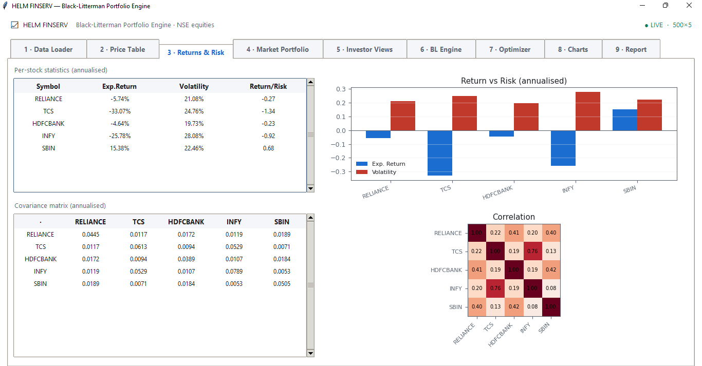
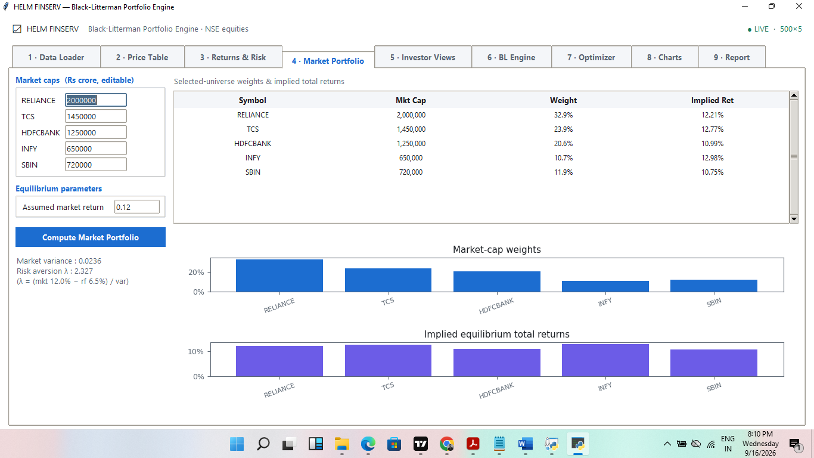
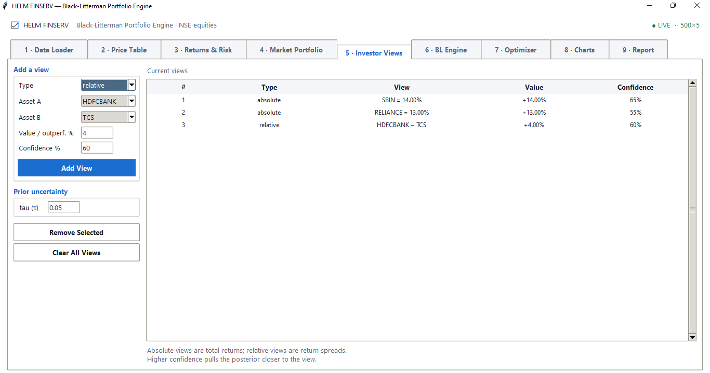
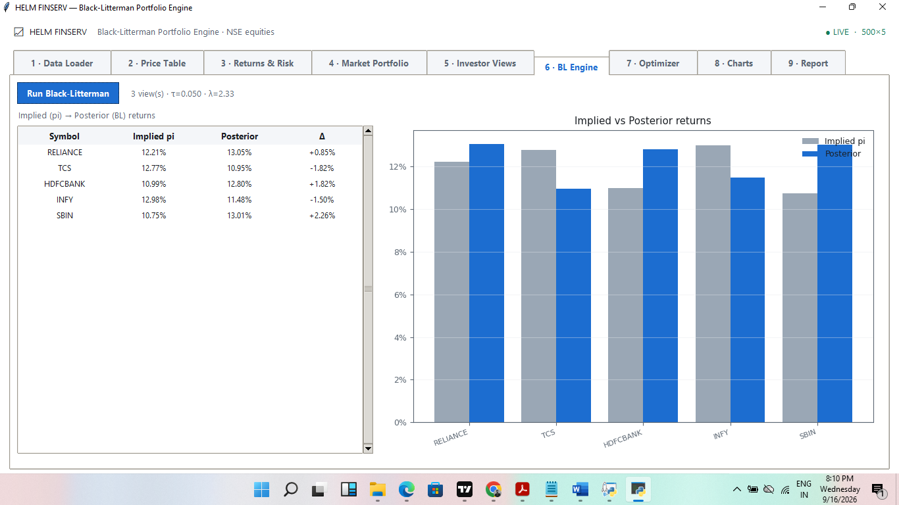
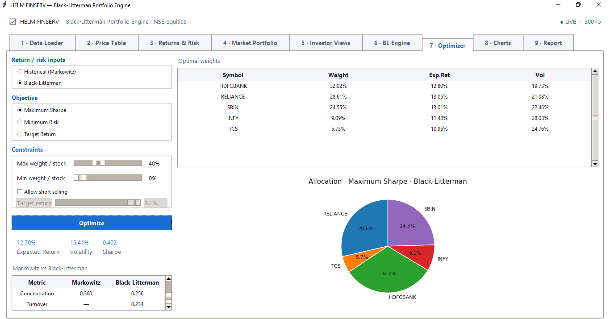
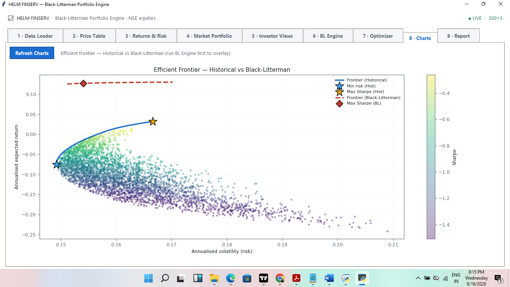
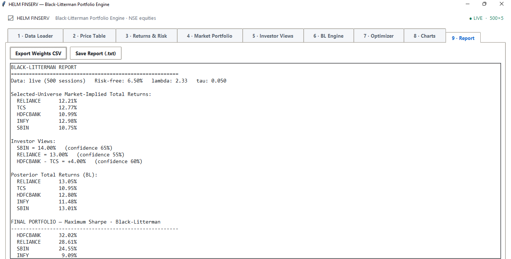

# Black–Litterman Portfolio Optimisation Engine

## Project overview

This repository presents the research logic, methodology and results of a portfolio-construction engine developed for NSE equities. It compares traditional Markowitz mean–variance optimisation with the Black–Litterman framework.

The project addresses a fundamental portfolio-management problem: historical average returns are noisy, unstable estimates of future performance. When those estimates are used directly, an optimiser may produce concentrated and economically unrealistic allocations.

Black–Litterman provides a more disciplined process by beginning with market-implied equilibrium returns and then incorporating investor views according to explicitly stated confidence levels.

The repository includes a clean standalone implementation of the quantitative core. It accepts a wide closing-price CSV or generates reproducible demonstration data.

## Run the research engine

```bash
pip install -r requirements.txt
python black_litterman_engine.py
```

To use a CSV containing `Date, RELIANCE, TCS, HDFCBANK, INFY, SBIN`:

```bash
python black_litterman_engine.py --prices your_prices.csv
```

The CSV must contain one `Date` column and closing-price columns named
`RELIANCE`, `TCS`, `HDFCBANK`, `INFY` and `SBIN`.

## Objective

The project aims to:

- Measure the historical return and risk characteristics of selected equities.
- Construct a market-cap-weighted selected-universe portfolio.
- Reverse-engineer the equilibrium returns implied by that portfolio.
- Represent absolute and relative investment views mathematically.
- Scale each view according to its confidence.
- Produce posterior expected returns using the Black–Litterman framework.
- Compare Markowitz and Black–Litterman allocations under identical constraints.
- Visualise the change in the efficient frontier.
- Evaluate return, volatility, Sharpe ratio, concentration and turnover.

## Research workflow

```text
Historical closing prices
          ↓
Returns, volatility, covariance and correlation
          ↓
Selected-universe market-cap weights
          ↓
Implied equilibrium excess returns
          ↓
Absolute and relative views with confidence
          ↓
Black–Litterman posterior returns and covariance
          ↓
Constrained portfolio optimisation
          ↓
Markowitz-vs-Black–Litterman comparison
          ↓
Efficient frontier and final research report
```

## 1. Return and risk estimation

Daily returns are calculated from consecutive closing prices:

```text
Return(t) = Price(t) / Price(t−1) − 1
```

The observations are used to estimate annualised return, volatility, covariance, correlation and return-to-risk ratios. The covariance matrix describes how pairs of stocks move together and forms the foundation of portfolio-risk estimation.



## 2. Selected-universe market portfolio

Each security receives a weight proportional to its market capitalisation:

```text
Market weight(i) = Market capitalisation(i) / Total market capitalisation
```

| Security | Weight |
|---|---:|
| RELIANCE | 32.9% |
| TCS | 23.9% |
| HDFCBANK | 20.6% |
| SBIN | 11.9% |
| INFY | 10.7% |

These weights represent the selected five-stock universe, not the entire Indian equity market.



## 3. Implied equilibrium returns

Market risk aversion is estimated as:

```text
λ = (Expected market return − Risk-free rate) / Market variance
```

The market-implied equilibrium excess returns are recovered through reverse optimisation:

```text
π = λΣw
```

`π` represents implied excess returns, `λ` represents market risk aversion, `Σ` is the covariance matrix, and `w` contains market-cap weights. The risk-free rate is added back when reporting total implied returns.

## 4. Investor views

An absolute view expresses an expected total return for one security:

```text
Expected return of SBIN = 14%
```

A relative view expresses how much one security is expected to outperform another:

```text
Expected return of HDFCBANK − Expected return of TCS = 4%
```

Each view is assigned a confidence level. Higher confidence gives the view more influence; lower confidence keeps the posterior estimate closer to equilibrium.

| View | Value | Confidence |
|---|---:|---:|
| SBIN absolute total return | 14.00% | 65% |
| RELIANCE absolute total return | 13.00% | 55% |
| HDFCBANK outperforms TCS | 4.00% | 60% |



## 5. Black–Litterman update

The posterior excess-return estimate is:

```text
μBL = π + τΣPᵀ(PτΣPᵀ + Ω)⁻¹(Q − Pπ)
```

Here, `P` identifies assets involved in the views, `Q` stores view returns, `Ω` represents view uncertainty and `τ` represents uncertainty in the equilibrium prior.

Absolute views are converted from total returns into excess returns before the update. Relative views require no adjustment because the risk-free rate cancels.

| Security | Market-implied total return | Posterior total return |
|---|---:|---:|
| RELIANCE | 12.21% | 13.05% |
| TCS | 12.77% | 10.95% |
| HDFCBANK | 10.99% | 12.80% |
| INFY | 12.98% | 11.48% |
| SBIN | 10.75% | 13.01% |



## 6. Portfolio optimisation

Three objectives are considered:

```text
Minimum variance: minimise wᵀΣw

Maximum Sharpe: maximise (wᵀμ − Risk-free rate) / √(wᵀΣw)

Target return: minimise wᵀΣw subject to wᵀμ = Target return
```

The analysed portfolio used long-only positions, a 0% minimum weight, a 40% maximum weight and fully invested weights summing to 100%. These constraints prevent the optimiser from placing the entire portfolio in one noisy estimate.



## 7. Efficient-frontier analysis

The efficient frontier contains portfolios offering the highest estimated return for each relevant level of risk. The displayed frontier begins at the global minimum-variance portfolio and excludes the dominated lower branch. The portfolio cloud is generated under the same weight restrictions used by the optimiser.



## 8. Model comparison

| Metric | Historical Markowitz | Black–Litterman |
|---|---:|---:|
| Expected return | 3.15% | 12.70% |
| Volatility | 16.66% | 15.41% |
| Sharpe ratio | −0.201 | 0.402 |
| Concentration HHI | 0.360 | 0.256 |
| Turnover | — | 0.234 |

The maximum-Sharpe Black–Litterman allocation was approximately:

| Security | Allocation |
|---|---:|
| HDFCBANK | 32.02% |
| RELIANCE | 28.61% |
| SBIN | 24.55% |
| INFY | 9.09% |
| TCS | 5.73% |



## What the project demonstrates

- Translation of portfolio theory into an end-to-end research workflow
- Correct separation of excess and total returns
- Reverse optimisation of equilibrium returns
- Mathematical representation of investor views
- Confidence-weighted Bayesian updating
- Constrained mean–variance optimisation
- Concentration and turnover measurement
- Monte Carlo and efficient-frontier analysis
- Clear communication of assumptions and limitations

## Limitations

- The equilibrium represents a five-stock selected universe, not the complete market.
- Market capitalisations and investor views are user-supplied assumptions.
- Historical estimates are in-sample and may not persist.
- The analysis excludes transaction costs, taxes, slippage and liquidity constraints.
- A positive modelled Sharpe ratio does not demonstrate out-of-sample profitability.
- A production study would require point-in-time data and walk-forward validation.

## Potential extensions

- Expand the universe to broader index constituents.
- Add point-in-time market weights and fundamentals.
- Introduce EWMA or shrinkage covariance estimators.
- Add transaction-cost and turnover penalties.
- Apply sector, liquidity and exposure constraints.
- Conduct walk-forward and out-of-sample testing.
- Compare performance against index and equal-weight benchmarks.
- Add drawdown, VaR, CVaR and stress testing.

## Author

**Ashish Kumar A**  
HELM FINSERV

## Disclaimer

This repository documents an educational quantitative-research project. It does not constitute investment advice, a solicitation, or a recommendation to buy or sell securities. Model estimates and historical results do not guarantee future performance.
